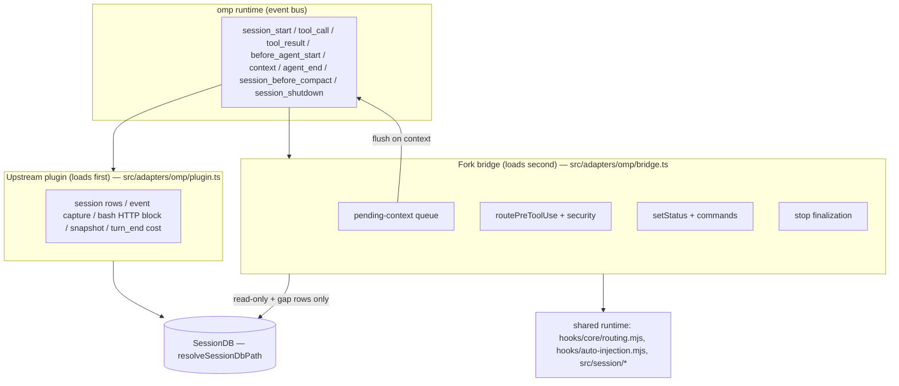

# OMP Hook Parity - Plan

## Goal Capsule

- **Objective:** Full-parity context-mode hook support for omp (Oh My Pi), delivered as a fork-owned in-process bridge extension, with a sync workflow that keeps upstream merges near-zero effort.
- **Product authority:** Fork owner (sole user; the fork is never upstreamed and never distributed).
- **Stop conditions:** Surface a blocker instead of guessing if omp's event bus behaves differently than `src/adapters/pi/extension.ts` assumes (event names, override semantics), or if the one-writer rule (R5) cannot be satisfied without modifying upstream's plugin.
- **Open blockers:** None.

---

## Product Contract

**Product Contract preservation:** changed — the capability-ownership table's mechanism column now routes auto-injection guidance through the `context` chain instead of `tool_result` overrides (pi-established pattern; override deferred to follow-up), and gains two bridge rows (PreToolUse routing beyond bash, ctx-stats/ctx-doctor commands). R/F/AE IDs and requirement text unchanged.

### Summary

Extend the fork so context-mode under omp matches the Claude Code integration in capability, via a fork-owned in-process bridge that fills only the gaps upstream's own omp plugin does not cover. Pair it with a codified merge-based sync ritual so absorbing upstream releases stays cheap indefinitely.

### Problem Frame

Upstream context-mode integrates with omp as MCP-only: the adapter declares `paradigm: "mcp-only"` (`src/adapters/omp/index.ts:64`), `HOOK_MAP` in `src/cli.ts` has no `omp` key, and the docs list omp hook commands as N/A — while the README implies broader support. Upstream does ship a partial in-process omp plugin (`src/adapters/omp/plugin.ts`, loaded via the `omp.extensions` array in `package.json`) covering five events: session-row init (`session_start`), an HTTP routing block (`tool_call`), event capture (`tool_result`), pre-compact snapshots (`session_before_compact`), and per-turn cost capture (`turn_end`). The rest of the Claude Code feature set is absent under omp.

This fork is the runtime — omp loads this working copy directly — and it will never be upstreamed. Upstream moves fast (adapter fixes and cost capture landed within days of the fork point) and regenerates six committed bundle files on every release, so any change that touches upstream-owned files converts into recurring merge pain.

### Key Decisions

- **In-process gap-filler bridge, not subprocess conformance or an out-of-tree overlay.** omp hooks are in-process `pi.on(...)` factories, which give higher fidelity than the JSON-stdio subprocess pattern (true blocking, context injection, native status API) with near-zero conflict surface. Mirroring the codex subprocess pattern would edit every platform-registry hotspot upstream churns; an out-of-tree overlay would trade compile-time coupling for silent runtime breakage.
- **The bridge complements upstream's plugin; it never reimplements it.** Upstream's omp plugin already owns session capture, the HTTP routing block, pre-compact snapshots, and cost capture. The bridge adds only what is missing. Upstream is actively converging on omp parity, so the fork's divergence shrinks over time as absorbed capabilities are retired.
- **Sibling-extension wiring, upstream files untouched.** The bridge loads as an additional entry in the `omp.extensions` array rather than rewriting `src/adapters/omp/plugin.ts`, which upstream actively evolves.
- **Parity means capability parity on omp-native surfaces, not byte-identical behavior.** Example: status display uses omp's status API rather than porting the Claude statusline script.
- **Conflict-surface minimization outranks pattern nativeness.** The fork is never upstreamed, so code need not read as if upstream wrote it.
- **Token reduction is preserved through routing, MCP indexing, and steering — not output rewriting.** Claude Code cannot rewrite tool outputs either; its savings come from blocking raw HTTP dumps, `ctx_*` tools indexing expensive output in a sandbox, and injected guidance steering the agent to cheap retrieval. The bridge delivers the same levers through omp's context chain.

### Requirements

**Parity surface**

- R1. Every capability of the Claude Code integration is available under omp, mapped to the omp mechanism that best serves it.
- R2. Capabilities upstream's omp plugin already provides are consumed as-is, never reimplemented.
- R3. The bridge covers the audited gaps: session-start context injection, prompt-time directives, auto-injection guidance after large tool outputs, security screening and routing beyond upstream's bash-only block, stop-time session finalization, and status display.

Capability ownership:

| Claude Code surface | omp mechanism | Owner |
|---|---|---|
| PostToolUse event capture | `tool_result` handler | Upstream plugin |
| HTTP routing block (bash) | `tool_call` block | Upstream plugin |
| PreCompact snapshot | `session_before_compact` | Upstream plugin |
| Token/cost capture | `turn_end` | Upstream plugin |
| Session row lifecycle | `session_start` | Upstream plugin |
| SessionStart context injection | `before_agent_start` + `context` chain | Bridge |
| UserPromptSubmit directives | `context` chain | Bridge |
| Auto-injection guidance | pending-context queue flushed via `context` | Bridge |
| PreToolUse routing beyond bash | `tool_call` block + queued guidance (accepted gap: `modify` decisions — no input mutation in omp's API) | Bridge |
| Stop finalization | `agent_end` / `session_shutdown` | Bridge |
| Statusline | `ctx.ui.setStatus` | Bridge |
| ctx-stats / ctx-doctor commands | `pi.registerCommand` | Bridge (parity-plus, mirrors pi) |
| MCP server, skills | Already wired | Upstream |

**Bridge architecture and coexistence**

- R4. All fork logic lives in new fork-owned files; edits to upstream-owned files are limited to minimal wiring, targeting a single added line.
- R5. One writer per data surface: the bridge never writes a session, event, or usage record that upstream's plugin already writes.
- R6. The bridge imports upstream internals with type checking, so upstream refactors surface as build failures at sync time rather than silent runtime breakage.
- R7. Coexistence with upstream's handlers must not degrade behavior: overlapping blocks are acceptable; overlapping data writes are not.

**Sync workflow**

- R8. Upstream syncs are merge-based with `git rerere` enabled; never rebase.
- R9. Bundle files are never hand-merged: on conflict, take upstream's version, run the build, and commit the regenerated output.
- R10. Each sync reviews upstream's omp plugin delta; any capability upstream absorbed is retired from the bridge.
- R11. A fork-local document records the seam inventory, the sync ritual, and current divergence. Upstream docs are never edited.

### Key Flows

- F1. Upstream sync
  - **Trigger:** Upstream publishes changes worth absorbing.
  - **Steps:** Fetch and merge upstream; `rerere` replays remembered resolutions; bundle conflicts resolved by taking theirs; run the build (regenerates bundles and type-checks the bridge against moved internals); review the upstream omp plugin delta and retire any bridge capability it absorbed; smoke-test a session under omp; commit.
  - **Outcome:** Fork current with upstream; fork-owned files untouched unless an internal API moved.
  - **Covers:** R6, R8, R9, R10.

### Acceptance Examples

- AE1. **Covers R5, R7.** Given a tool call completes under omp, when both upstream's plugin and the bridge observe `tool_result`, then exactly one event row lands in the session DB and stats/search/cost report it once.
- AE2. **Covers R2, R10.** Given an upstream release adds a capability its omp plugin now provides and the bridge also implements, when the sync review runs, then the bridge's implementation is removed and upstream's kept.
- AE3. **Covers R4, R6.** Given upstream refactors an internal module the bridge imports, when the post-merge build runs, then it fails loudly and the fix is confined to fork-owned files.

### Success Criteria

- A routine upstream sync is merge + rebuild + commit, with no manual edits to fork-owned code — excepting capability retirements mandated by R10/AE2 and type-fix fallout when upstream internals move — and no hand-merged bundles.
- Under omp, `ctx_stats`, `ctx_search`, cost reporting, and Insight data match the fidelity of the same session run under Claude Code — no duplicates, no gaps.

### Scope Boundaries

- No upstreaming of any change; no PRs to the parent repo.
- No subprocess-hook conformance (no `hooks/omp/` scripts, no `HOOK_MAP` entry, no adapter `generateHookConfig`).
- No publishing or distributing the fork; single-user runtime only.
- No edits to upstream README or `docs/platform-support.md` claims; the fork-local doc carries reality.
- Accepted parity gap: `routePreToolUse` `modify` decisions (Agent-tool input injection) are not expressible in omp's `{block, reason}` tool_call API. Mooted in practice: omp subagent sessions load the same extensions and receive the bridge's own session-start injection.

**Deferred to Follow-Up Work**

- `tool_result` content override that replaces an already-produced large output with an indexed preview — a beyond-parity token saver omp uniquely enables (omp's last-override-wins semantics make it feasible; upstream's handler returns nothing, so a bridge override would apply cleanly). Deserves its own design pass because it mutates results the model may still need.
- Small owned diff so adapter metadata and doctor stop reporting omp as MCP-only. Cosmetic only; left untouched for now.
- Insight/platform-bridge forwarding for in-process writes — upstream's plugin inserts directly without `maybeForward`; matching that gap is upstream's to close.
- Relaxing the bash HTTP block to pi's `isSafeCurlWget` "safe curl-to-disk" allowance. Upstream's stricter blanket block fires first and stays authoritative.

### Dependencies / Assumptions

- omp loads `package.json` `omp.extensions` entries as in-process `HookAPI` factories, in array order. Documented in omp's hook docs and upstream's plugin comments; not executable-verified from this repo alone.
- Upstream continues investing in its omp plugin; the gap-filler model benefits from, and does not depend on, that continuing.
- `hooks/session-attribution.bundle.mjs` is git-tracked but not regenerated by the `build` script, unlike the six CI force-added bundles — the sync ritual takes upstream's copy on conflict and never hand-merges it.
- Upstream's plugin entry remains first in `omp.extensions`; the bridge assumes upstream owns session rows and degrades to capture-less steering (log a warning, skip DB-dependent features) if that entry is missing.

### Sources

- `src/adapters/pi/extension.ts` — the proven in-process pattern: `_pendingContext` queue flushed via the `context` hook (issue #598), dynamic `hooks/auto-injection.mjs` import, `registerCommand('ctx-stats'|'ctx-doctor')`, `ctx.ui.notify` when UI present.
- `src/adapters/omp/plugin.ts` — upstream's five-event omp plugin (session init, bash block, capture, snapshot, cost) plus MCP self-registration; test exports `_resetOmpPluginStateForTests`, `_getOmpPluginSessionIdForTests`.
- `hooks/sessionstart.mjs`, `hooks/pretooluse.mjs`, `hooks/posttooluse.mjs`, `hooks/stop.mjs` — the Claude Code behaviors being mapped; entry points `buildAutoInjection` (`hooks/auto-injection.mjs`), `routePreToolUse`/`initSecurity` (`hooks/core/routing.mjs`), `buildSessionDirective` (`hooks/session-directive.mjs`), `createRoutingBlock`/`createToolNamer` (`hooks/routing-block.mjs`).
- `src/session/db.ts` (`SessionDB`, `resolveSessionDbPath`), `src/session/extract.ts`, `src/session/snapshot.ts`, `src/session/analytics.ts` — typed internals the bridge imports.
- `tests/adapters/omp-plugin.test.ts`, `tests/pi-extension.test.ts` — mock-factory test pattern (`createMockOmpApi`, handler collection, `_trigger`).
- `package.json:43-48,82-85` — `omp.extensions` array (the wiring seam); `tsc` emits any new `src/` file to `build/` with no build-script change; `assert-bundle`/`assert-asymmetric-drift` do not enumerate `src/**`.
- `.github/workflows/bundle.yml:38` — CI force-add of six bundle artifacts; the bundle-churn source at sync time.
- omp harness hook documentation — event surface, block short-circuit, last-override-wins on `tool_result`, `ctx.ui` status API, no-UI defaults.

---

## Planning Contract

### Key Technical Decisions

- **KTD1 — Bridge lives at `src/adapters/omp/bridge.ts`, wired by one appended `omp.extensions` entry.** `tsc` (`rootDir: src`, `outDir: build`) emits `build/adapters/omp/bridge.js` with zero build-script changes; `assert-bundle` and `assert-asymmetric-drift` don't enumerate `src/**`. Total upstream-file diff: one line in `package.json`.
- **KTD2 — Session identity is derived, never owned.** The bridge derives the session ID with the same algorithm as upstream's `deriveSessionId` (from the omp session-manager ctx, rebound on each `session_start`) and resolves the DB path via `resolveSessionDbPath` + `OMPAdapter.getSessionDir()` — the same pair both existing plugins use. It never calls `ensureSession`, `cleanupOldSessions`, `upsertResume`, or `incrementCompactCount`; upstream is the sole session-row writer (R5).
- **KTD3 — All injected guidance rides a pending-context queue flushed on the `context` hook, seeded from `before_agent_start`.** This is the pattern pi established (issue #598: mutating the system prompt broke sessions); it maps to Claude's `additionalContext` semantics. The queue's registration and drain live in U1 so no later unit's guidance can be dropped: the `context` handler is registered at scaffold time and the flush defers until `session_start` has bound the session ID. No `tool_result` content overrides in this plan (deferred).
- **KTD4 — The bridge registers no `turn_end` handler.** Upstream owns usage/cost capture there. Stop-time finalization uses `agent_end`/`session_shutdown` and writes only row types upstream does not write; if the audit during U6 finds upstream's `turn_end` already covers the stop semantics, U6 ships status-only.
- **KTD5 — Routing/security reuse the shared runtime, not a reimplementation.** `routePreToolUse`, `initSecurity`, and `isSecurityInitFailed` come from `hooks/core/routing.mjs` via dynamic import (the same module every subprocess platform uses; it loads `hooks/security.bundle.mjs` internally); `buildAutoInjection` from `hooks/auto-injection.mjs`. The bridge resolves the package root from its own module URL (three levels up from `build/adapters/omp/`) to locate `hooks/*.mjs` and to pass `initSecurity` the `build/` directory. Typed `src/session/*` imports for DB/snapshot/analytics. Upstream refactors then fail `tsc` or the bridge's import smoke test loudly at sync time (R6).
- **KTD6 — Handler-order contract: upstream first, bridge second.** Registration order follows the `omp.extensions` array. `tool_call` blocks short-circuit on first block, so upstream's blanket bash HTTP block wins before bridge policy runs — accepted (stricter than pi; divergence noted in Scope Boundaries).
- **KTD7 — Decision mapping is bridge-local.** `hooks/core/formatters.mjs` has no omp formatter; a small `mapDecision` translates `routePreToolUse` results: deny → `{ block, reason }`, context/redirect → queued guidance, `modify`/`ask` → the accepted parity gap (log once, allow).

### High-Level Technical Design

Ownership boundary: upstream writes all capture rows; the bridge reads the DB for status/resume content and writes only gap rows (stop finalization, if any). Guidance always exits through the context flush, never by mutating tool results.

### Assumptions

- omp event names and result contracts match the harness hook docs and `refs/` comments in upstream sources (`tool_call` block short-circuit, `tool_result` last-override-wins, `context` message chain).
- Two extension modules may hold independent `SessionDB` handles on the same SQLite file; better-sqlite3 serializes writes safely (same pattern as MCP server + plugin coexisting today).

---

## Implementation Units

### U1. Bridge scaffold, wiring, and session coordination

- **Goal:** A loadable second omp extension that derives session identity correctly and enforces the one-writer rule from day one.
- **Requirements:** R4, R5, R6.
- **Dependencies:** None.
- **Files:** `src/adapters/omp/bridge.ts` (new), `package.json` (append one `omp.extensions` entry), `tests/adapters/omp-bridge.test.ts` (new).
- **Approach:** Default-export a factory taking the same `MinimalHookAPI` shape upstream's plugin declares locally. Module-level singletons mirroring upstream (`_sessionId` rebound on `session_start`, lazy DB handle via `resolveSessionDbPath` + `OMPAdapter.getSessionDir()`). Session-ID derivation duplicates upstream's `deriveSessionId` algorithm (it is unexported; a comment ties the copy to its source for sync review). No `ensureSession`/cleanup calls. Includes the package-root resolver (KTD5), the pending-context queue with its `context` handler registered here (KTD3: flush deferred until the session ID is bound), and a dynamic-import smoke test target covering the `.mjs` runtime modules the bridge loads (`hooks/core/routing.mjs`, `hooks/auto-injection.mjs`, `hooks/session-directive.mjs`, `hooks/routing-block.mjs`). Export `_resetOmpBridgeStateForTests` mirroring upstream's test hook. Every handler body is wrapped best-effort — a bridge failure must never break the agent turn (same posture as upstream).
- **Patterns to follow:** `src/adapters/omp/plugin.ts` (singletons, best-effort try/catch, local HookAPI type), `tests/adapters/omp-plugin.test.ts` (`createMockOmpApi`, handler collection, `_trigger`).
- **Test scenarios:**
  - Factory registers without error on a mock API; the scaffold registers `session_start` + `context` and excludes `turn_end` (the full parity event set is asserted in U6's integration test, since U2-U6 add handlers incrementally).
  - `session_start` rebinds the bridge session ID to the same value upstream derives for the same ctx (parity assertion against `_getOmpPluginSessionIdForTests`).
  - Covers AE1: with both upstream plugin and bridge registered on one mock API, a `tool_result` trigger produces exactly one event row in the DB.
  - A handler that throws internally does not propagate (turn survives).
  - Queue drain: guidance queued before `session_start` is held, then flushed on the first `context` after the session ID binds; a `context` trigger with an empty queue injects nothing.
  - Dynamic-import smoke test: each `.mjs` runtime module the bridge depends on resolves and exposes its expected export.
  - With upstream's extension absent, bridge logs a warning and DB-dependent features no-op.
- **Verification:** New test file passes; `npm run build` emits `build/adapters/omp/bridge.js` with no build-script edits; `git diff` upstream-owned files shows only the one `package.json` line.

### U2. Session-start context injection

- **Goal:** Parity with `hooks/sessionstart.mjs`: routing rules, security warning, and resume/compaction context reach the model at session start.
- **Requirements:** R1, R3 (session-start injection).
- **Dependencies:** U1.
- **Files:** `src/adapters/omp/bridge.ts`, `tests/adapters/omp-bridge.test.ts`.
- **Approach:** On `before_agent_start`/`session_start`, queue into the pending-context buffer: the routing block built via `createRoutingBlock(createToolNamer(...))` with omp's tool namer (mirror `hooks/sessionstart.mjs:49` — never the static `ROUTING_BLOCK`, whose text names claude-code tools), the security fail-open warning when `isSecurityInitFailed()`, and resume/compaction context. Lifecycle branching uses omp-native signals in place of Claude's `input.source`: a fresh session queues startup content; `session_compact` marks the next `session_start`/`before_agent_start` as compact-resume; an unconsumed snapshot in `SessionDB.getResume` marks a resumed session (mark consumed via `markResumeConsumed` after injecting). Skip the install-heal steps `sessionstart.mjs` performs; they are Claude-plugin-cache specific.
- **Patterns to follow:** `src/adapters/pi/extension.ts` `_pendingContext` + `context` flush; `hooks/sessionstart.mjs` branch structure (startup vs resume vs compact).
- **Test scenarios:**
  - Fresh session: flushed context contains routing block text exactly once, naming omp tools (not claude-code names).
  - Compact-resume session with a stored snapshot: flushed context includes the snapshot content.
  - Security init failure: warning text queued; success: absent.
  - Two consecutive `context` triggers: second flush injects nothing (queue drained).
- **Verification:** Test slices pass; under a live omp session the first agent turn shows routing guidance in effect (agent prefers `ctx_*` tools).

### U3. User-prompt capture and directives

- **Goal:** Parity with `hooks/userpromptsubmit.mjs`: prompt-time directives are honored and user-prompt features that upstream does not capture are recorded.
- **Requirements:** R1, R3 (prompt directives), R5.
- **Dependencies:** U1 (queue infrastructure), U2 (lifecycle signals).
- **Files:** `src/adapters/omp/bridge.ts`, `tests/adapters/omp-bridge.test.ts`.
- **Approach:** Detect the newest user message on the `context` chain (mirroring pi's prompt path), run `buildSessionDirective` parsing against it, and queue any directive response. Before writing any `user-prompt` event row, audit the SessionDB row types upstream's plugin already records — write only row types it does not (R5); if upstream covers them all, this unit ships directive handling only. Do not adopt `attributeAndInsertEvents` from `hooks/session-loaders.mjs` — it drags the deferred Insight forwarding into scope; direct `db.insertEvent` matches upstream's posture.
- **Execution note:** Spike first — verify omp's `context` event payload actually carries the message array with user roles as the harness docs describe, before building detection on it.
- **Patterns to follow:** `src/adapters/pi/extension.ts` prompt path; `hooks/userpromptsubmit.mjs` + `hooks/session-directive.mjs`.
- **Test scenarios:**
  - A prompt containing a session directive produces the directive's injected response in the next flush.
  - A plain prompt produces no injection and no duplicate event rows (covers AE1's spirit for the prompt path).
- **Verification:** Test slices pass; a directive issued in a live omp session takes effect.

### U4. Pre-tool routing and security screening

- **Goal:** Parity with `hooks/pretooluse.mjs`: full `routePreToolUse` policy (Read/Grep/WebFetch/Agent/MCP and richer bash analysis) beyond upstream's bash-regex block.
- **Requirements:** R1, R3 (security/routing), R7.
- **Dependencies:** U1, U2 (pending-context queue and security-warning path).
- **Files:** `src/adapters/omp/bridge.ts`, `tests/adapters/omp-bridge.test.ts`.
- **Approach:** `tool_call` handler maps omp tool names through the PascalCase map (mirror upstream's `OMP_TOOL_MAP`), initializes security lazily on first tool call (`initSecurity` pointed at the package root's `build/` per KTD5; a missing or stale `build/` fails open and sets the U2 warning path) and calls `routePreToolUse` with the stable session ID from U1. Decisions translate through the bridge-local `mapDecision` (KTD7): deny → `{ block, reason }`; context/redirect → guidance queued for the next `context` flush; `modify`/`ask` → accepted parity gap, allow and log once. Upstream's bash HTTP block fires first and stays authoritative (KTD6) — the bridge handler treats bash HTTP as already-handled.
- **Patterns to follow:** `hooks/pretooluse.mjs` decision handling and `tests/core/routing.test.ts` policy cases (pi is not a routing reference — its extension inlines bash-only blocking and never calls `routePreToolUse`).
- **Test scenarios:**
  - A tool call the policy denies returns a block with the formatted reason.
  - A tool call producing a context decision queues guidance and does not block.
  - Security init failure: handler fails open (no block) and the U2 warning path is set.
  - Ordering: with both extensions registered, a bash `curl` is blocked by upstream's handler before bridge policy runs.
  - A `modify`-decision tool call (Agent-tool shape) is allowed, logged once, and never mutated (accepted gap).
- **Verification:** Test slices pass; in a live omp session a denied pattern is blocked with the policy reason visible to the agent.

### U5. Auto-injection guidance after large outputs

- **Goal:** Parity with the post-large-output steering path: after an indexed/oversized output, the agent is told to retrieve via `ctx_search` instead of re-reading.
- **Requirements:** R1, R3 (auto-injection), R5, R7.
- **Dependencies:** U1, U2.
- **Files:** `src/adapters/omp/bridge.ts`, `tests/adapters/omp-bridge.test.ts`.
- **Approach:** A read-only `tool_result` observer (never returns an override, never writes rows) feeds `buildAutoInjection` (dynamic import of `hooks/auto-injection.mjs`); non-empty guidance is queued for the next `context` flush. This is the token-reduction steering lever — transport differs from Claude's `additionalContext`, economics identical.
- **Patterns to follow:** `src/adapters/pi/extension.ts` `getAutoInjection()` usage.
- **Test scenarios:**
  - An oversized/indexed tool result queues guidance mentioning retrieval; next flush delivers it once.
  - A small result queues nothing.
  - Covers AE1: the observer path inserts zero DB rows.
- **Verification:** Test slices pass; in a live omp session a >5KB `ctx_execute` output is followed by injected search guidance on the next turn.

### U6. Stop finalization, status display, and commands

- **Goal:** Parity with `hooks/stop.mjs` semantics that upstream's `turn_end` does not already cover, plus statusline-equivalent KPIs and the pi slash commands.
- **Requirements:** R1, R3 (stop, status), R5.
- **Dependencies:** U1.
- **Files:** `src/adapters/omp/bridge.ts`, `tests/adapters/omp-bridge.test.ts`.
- **Approach:** First audit `hooks/stop.mjs` row types against upstream's `turn_end` capture; register `agent_end`/`session_shutdown` handlers only for genuinely missing rows (KTD4). Status: on turn boundaries compute KPIs via the typed `AnalyticsEngine` (`src/session/analytics.ts`) + `SessionDB` — the chosen stats path for both `setStatus` and `ctx-stats`, aligning with KTD5's typed-import drift detection (not pi's local `buildStatsText`) — and publish via `ctx.ui.setStatus`, a no-op headless per omp's no-UI defaults. Register `ctx-stats` and `ctx-doctor` via `pi.registerCommand`, mirroring pi's `handleCommandText` (`ctx.ui.notify` when `ctx.hasUI`).
- **Patterns to follow:** `bin/statusline.mjs` KPI derivation; `src/adapters/pi/extension.ts` command registration.
- **Test scenarios:**
  - Covers AE1: with upstream registered, stop-path handlers add zero duplicate usage/turn rows.
  - `setStatus` called with sanitized KPI text after a turn; headless ctx: no throw.
  - `ctx-stats` command returns stats text derived from the shared DB.
- **Verification:** Test slices pass; live omp session shows the status segment and a working `/ctx-stats`.

### U7. Sync ritual and fork documentation

- **Goal:** R8-R11 codified so every future sync is mechanical.
- **Requirements:** R8, R9, R10, R11.
- **Dependencies:** U1-U6 (documents the final seam inventory).
- **Files:** `FORK.md` (new, repo root), `docs/plans/2026-07-20-001-feat-omp-hook-parity-plan.md` (link from FORK.md).
- **Approach:** `FORK.md` records: the upstream remote to add (`git remote add upstream <parent-url>`) and one-time `git config rerere.enabled true`; the merge-based sync steps matching F1 verbatim; the bundle rule — take theirs on any `*.bundle.mjs` conflict including `hooks/session-attribution.bundle.mjs`, then `npm run build` and commit regenerated output; the seam inventory (the single `package.json` line, all fork-owned files); and the sync-review checklist item: diff upstream's `src/adapters/omp/plugin.ts`, retire absorbed bridge capabilities (AE2). Note the accepted divergences (stricter bash block, docs left wrong upstream).
- **Test scenarios:** Test expectation: none — documentation and git configuration only.
- **Verification:** A dry-run `git fetch upstream && git merge --no-commit --no-ff upstream/main` following FORK.md resolves without manual edits to fork-owned files beyond the R10/AE2 retirement review (or FORK.md's steps handle what arises), then the merge is aborted.

---

## Verification Contract

| Gate | Command | Applies to |
|---|---|---|
| Bridge tests | `npx vitest run tests/adapters/omp-bridge.test.ts` | U1-U6 |
| Adapter regression | `npx vitest run tests/adapters/` | U1-U6 (upstream plugin tests must stay green) |
| Full suite | `npm test` (runs `pretest` build) | Before declaring done |
| Build/type gate | `npm run build` | Every unit; also the R6 drift detector |
| Live smoke | omp session in this repo: routing guidance visible, a blocked pattern blocks, `ctx_stats` shows this session once (no duplicates), status segment renders, `/ctx-stats` responds | U2-U6, AE1 |
| Sync dry-run | FORK.md ritual against `upstream/main`, aborted after verification | U7, F1 |

---

## Definition of Done

- All seven units land; `npm test` and `npm run build` green.
- AE1-AE3 demonstrably hold: single-row capture verified in the live smoke, sync dry-run exercises the ritual, `git diff` against upstream shows exactly one modified upstream-owned line (`package.json`) plus fork-owned new files.
- Success criteria met: `ctx_stats`/`ctx_search`/cost under omp match a Claude Code session's fidelity; sync is merge + rebuild + commit.
- No abandoned experimental code paths remain in `src/adapters/omp/bridge.ts`; every handler traces to a requirement or was removed.
- `FORK.md` reflects the shipped seam inventory, not the planned one.
